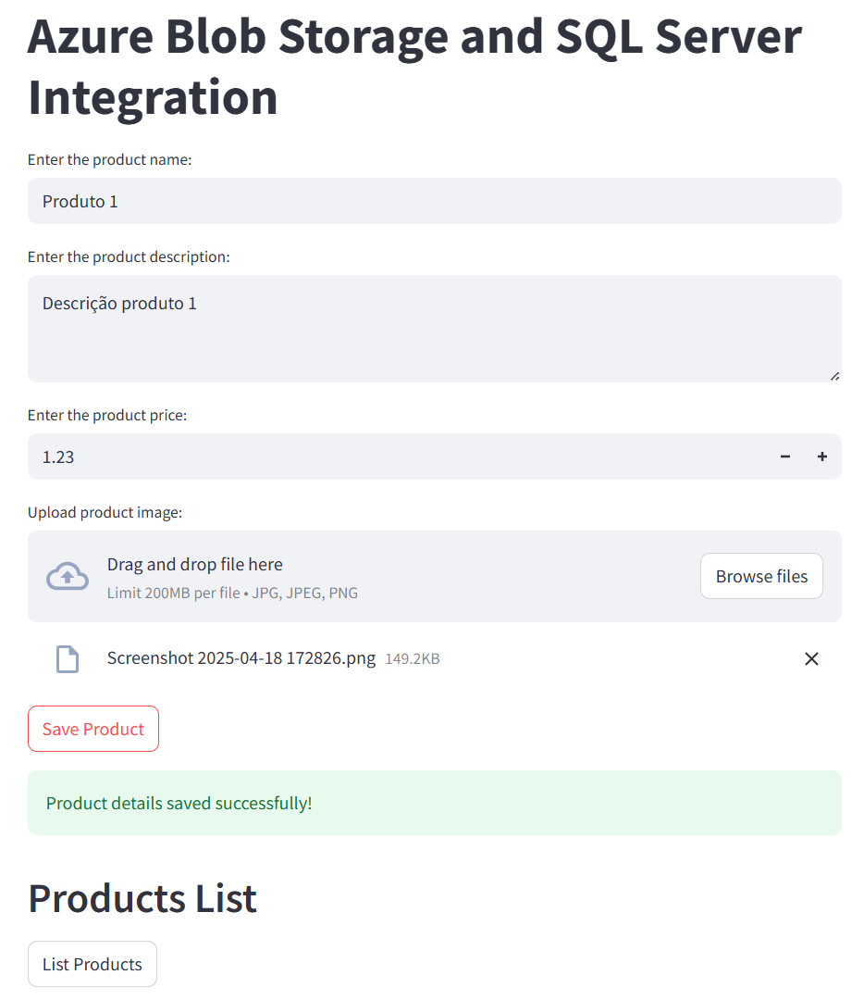
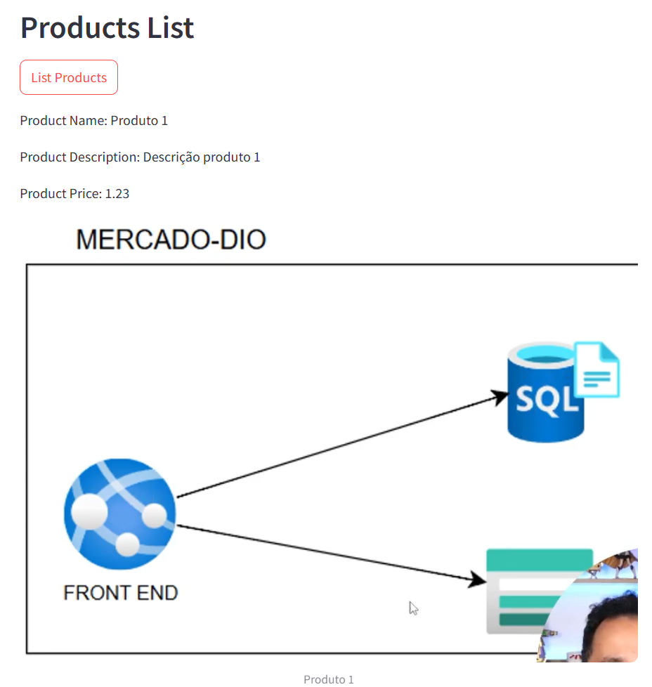

# E-Commerce Challenge - Azure Cloud Native

## Project Overview
This project is part of the Digital Innovation One training program in collaboration with Microsoft. The goal is to build a cloud-native e-commerce application using Azure services. The project demonstrates best practices for cloud architecture, scalability, and maintainability.

## Features
- Cloud-native architecture
- Scalable and resilient design
- Integration with Azure services
- Modular and extensible codebase

## Configuration
1. Clone the repository:
    ```bash
    git clone <https://github.com/wglastonio/dio-azure-native-e-commerce>
    cd e-commerce-desafio1
    ```
2. Set up environment variables:
    - Create a `.env` file in the root directory.
    - Add the required variables (e.g., Azure credentials, database connection strings).
        - BLOB_CONNECTION_STRING
        - BLOB_CONTAINER_NAME
        - BLOB_ACCOUNT_NAME
        - SQL_SERVER
        - SQL_USERNAME
        - SQL_PASSWORD

3. Deploy Azure resources:
    - Use the provided ARM templates or Terraform scripts to deploy the necessary Azure infrastructure.

4. Install dependencies:
    ```bash
    pip install -r requirements.txt
    ```

5. Start the application:
    ```bash
    streamlit run main.py
    ```
## Results

**Main Page**



**List Products**


## Dependencies
- **Node.js**: Backend runtime environment
- **Express.js**: Web framework
- **Azure SDK**: Integration with Azure services
- **MongoDB**: Database for storing e-commerce data
- **dotenv**: Environment variable management

## Azure Services Used
- **Azure SQL Database**: SQL database
- **Azure SQL Server**: SQL server required by database
- **Azure Storage Account**: Manage access to the database

## How to Contribute
1. Fork the repository.
2. Create a feature branch:
    ```bash
    git checkout -b feature/your-feature-name
    ```
3. Commit your changes and push to your fork.
4. Open a pull request.

## License
This project is licensed under the MIT License. See the [LICENSE](LICENSE) file for details.

## Contact
For questions or feedback, please reach out to the project maintainers.

## Note
README.md file created by Microsoft Copilot and adjusted by the project Wglastonio.
